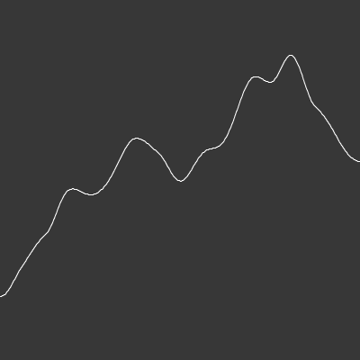

## processing_experiments

### [ball bounce](https://github.com/alexthescott/processing_experiments/tree/main/ball_bounce_py)

### [painting](https://github.com/alexthescott/processing_experiments/tree/main/paint_app_py)

### [perlin noise](https://github.com/alexthescott/processing_experiments/tree/main/perlin_noise_py) 

