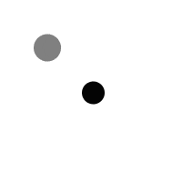
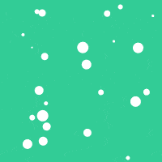

## 4 variants on a bouncing ball

### [ball bounce 0](https://github.com/alexthescott/processing_experiments/tree/main/ball_bounce_py/ball_bounce_0)
Basic version of a bouncing circle. Position and velocity variables are created, conditional statements are used to invert velocity variables once an edge is hit.

### [ball bounce 1](https://github.com/alexthescott/processing_experiments/tree/main/ball_bounce_py/ball_bounce_1)
Two bouncing circles are drawn to the screen, but without object orientation, we must duplicate our position and velocity variables, as well as the conditional statements to bounce off edges.

### [ball bounce 2](https://github.com/alexthescott/processing_experiments/tree/main/ball_bounce_py/ball_bounce_2)
25 bouncing circles are drawn to the screen, utilizing object orientation to create many objects from our class definition!

### [bouncing dvd logo](https://github.com/alexthescott/processing_experiments/tree/main/ball_bounce_py/bouncing_dvd_logo)
A silly, and satisfying variation of ball bounce 0. We load and tint the dvd logo, changing colors once the logo hits the edges of the screen!
