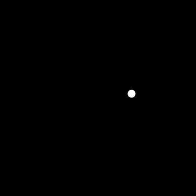
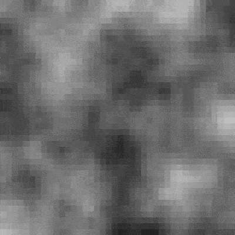
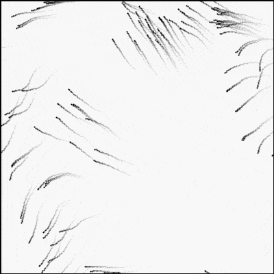

## 4 variants on a perlin noise

### [perlin 1d 0](https://github.com/alexthescott/processing_experiments/tree/main/perlin_noise_py/perlin_1d_0)

Graphing 1D perlin noise which scrolls at a regular pace

### [perlin 1d 1](https://github.com/alexthescott/processing_experiments/tree/main/perlin_noise_py/perlin_1d_1)

Sampling two points in 1D perlin noise to determine the x and y position of a moving circle. A transparent background is used to show movement over time.

### [perlin 2d 0](https://github.com/alexthescott/processing_experiments/tree/main/perlin_noise_py/perlin_2d_0)

"classical" representation of 2D perlin noise. Look at the Wiki page for context. A low-res representation of 2D nosie space! 

### [perlin 2d 1](https://github.com/alexthescott/processing_experiments/tree/main/perlin_noise_py/perlin_2d_1)
2D perlin noise is used in an invisible grid to determine a velocity direction which "push" particles.

